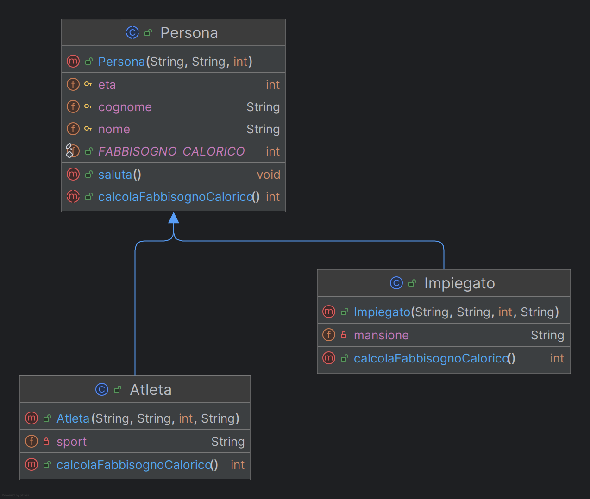

# Astrazione ed ereditarietà

## Introduzione

Uno dei principi fondamentali e fondanti della programmazione orientata agli oggetti, è quello di 
**astrazione**.

L'idea è quella di ridurre la complessità di un sistema, concentrandosi sugli aspetti essenziali e 
tralasciando i dettagli superflui. 

Attraverso l’astrazione, possiamo **modellare concetti generali che fungono da base per entità più 
specifiche**.

Immaginiamo di voler rappresentare in un programma diverse categorie di persone, ad esempio musicisti 
e attori. 
Entrambe queste categorie condividono alcune caratteristiche comuni: un nome, un’età, un’altezza. 
Per evitare di ripetere questi campi più volte, possiamo raccoglierli in una classe più generale, 
che chiameremo `Persona`.

Dobbiamo tuttavia osservare un punto fondamentale: non ha senso istanziare direttamente un 
oggetto della classe `Persona`: nessuna persona è rappresentata soltanto da nome, età e altezza; 
ogni individuo possiede qualità (attributi) ulteriori come abilità, passioni e obiettivi che lo
caratterizzano "completamente". 
Per questa ragione, la classe `Persona` non rappresenta un’entità concreta, bensì un concetto astratto.

## Classi astratte
In Java, quando una classe serve soltanto a definire una struttura comune e non deve mai essere 
istanziata direttamente, la dichiariamo con la parola chiave `abstract`. 

Una classe astratta può contenere:
- Campi e metodi concreti, già implementati e pronti all’uso.
- Metodi astratti, cioè privi di implementazione, che dovranno essere necessariamente ridefiniti 
  dalle classi derivate.

Va notato che se in una certa classe sono presenti metodi astratti, a maggior ragione è "impossibile" 
istanziarla, in quanto non è disponibile il codice da eseguire laddove venissero invocati tali metodi.

Vediamo un esempio:

Un `Impiegato` è una persona tipicamente sedentaria. Se generalmente il fabbisogno calorico di un adulto
si può considerare di circa 2000 kcal al giorno, nel caso dell'impiegato esso si può assumere sia sensibilmente
ridotto rispetto al caso generale, in virtù della ridotta attività fisica di tale individuo.

Un `Atleta` invece si può considerare una persona con attività fisica intensa.  Il suo fabbisogno calorico sarà 
tendenzialmente maggiore rispetto alla media, poiché un allenamento costante comporta un consumo energetico elevato.
Possiamo quindi ipotizzare che un atleta possa aver bisogno di 3000–3500 kcal al giorno o più, a seconda dello sport 
praticato.

Proviamo a modellare questi concetti in Java:

```java
public abstract class Persona {
    // ATTENZIONE: visibilità "protected"
    protected String nome;
    protected String cognome;
    protected int eta;

    // Costante accessibile ovunque
    public static final int FABBISOGNO_CALORICO = 2000;

    public Persona(String nome, String cognome, int eta) {
        this.nome = nome;
        this.cognome = cognome;
        this.eta = eta;
    }

    // Metodo concreto, comune a tutti i tipi di Persona
    public void saluta() {
        System.out.println("Ciao, mi chiamo " + nome + " " + cognome + " e ho " + eta + " anni!");
    }

    // Metodo astratto: non ha corpo, deve obbligatoriamente essere implementato
    // nelle sottoclassi
    public abstract int calcolaFabbisognoCalorico();
}
```

Osserviamo che il metodo `calcolaFabbisognoCalorico()` è astratto e non ha corpo: non è possibile determinare
nella classe base quale sia il fabbisogno calorico di una persona qualsiasi, in quanto dipende dal tipo di
attività fisica che svolge. Deve quindi essere implementato nelle specifiche classi derivate, ciascuna con il
calcolo corretto in base alle caratteristiche della "categoria" di persona che si intende modellare.

```java
public class Impiegato extends Persona {
    private String mansione;

    public Impiegato(String nome, String cognome, int eta, String mansione) {
        super(nome, cognome, eta);
        this.mansione = mansione;
    }

    // Implementazione del metodo astratto
    @Override
    public int calcolaFabbisognoCalorico() {
        return (int)(FABBISOGNO_CALORICO * 0.8);
    }
}

// Classe concreta che estende Persona
public class Atleta extends Persona {
    private String sport;

    public Atleta(String nome, String cognome, int eta, String sport) {
        super(nome, cognome, eta);
        this.sport = sport;
    }

    // Implementazione personalizzata del metodo astratto
    @Override
    public int calcolaFabbisognoCalorico() {
        return (int)(FABBISOGNO_CALORICO * 1.5); // oppure direttamente return 3000;
    }
}
```

Un diagramma che rappresenta la gerarchia di persone che abbiamo
considerato nel nostro problema, è rappresentato nell'immagine seguente:



